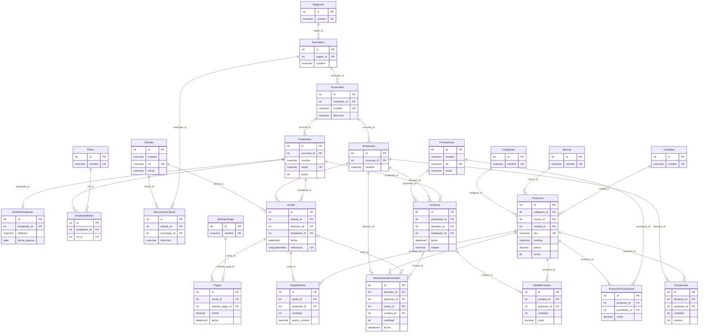

# Diagrama entidad-relacion

[Descargar PNG](diagrama_er.png) | [Fuente Mermaid](diagrama_er.mmd)

Codigo Mermaid editable

```mermaid
erDiagram
    Regiones {
        int id PK
        nvarchar nombre UK
    }
    Municipios {
        int id PK
        int region_id FK
        nvarchar nombre
    }
    Sucursales {
        int id PK
        int municipio_id FK
        nvarchar nombre UK
        nvarchar direccion
    }
    Almacenes {
        int id PK
        int sucursal_id FK
        nvarchar nombre
    }
    Roles {
        int id PK
        nvarchar nombre UK
    }
    Empleados {
        int id PK
        int sucursal_id FK
        nvarchar nombre
        nvarchar email UK
        bit activo
    }
    PerfilesEmpleado {
        int id PK
        int empleado_id FK
        nvarchar telefono
        date fecha_ingreso
    }
    EmpleadoRoles {
        int id PK
        int empleado_id FK
        int rol_id FK
    }
    Clientes {
        int id PK
        nvarchar nombre
        nvarchar nit UK
        nvarchar email
    }
    DireccionesCliente {
        int id PK
        int cliente_id FK
        int municipio_id FK
        nvarchar direccion
    }
    Proveedores {
        int id PK
        nvarchar nombre
        nvarchar nit UK
        nvarchar email
    }
    Categorias {
        int id PK
        nvarchar nombre UK
    }
    Marcas {
        int id PK
        nvarchar nombre UK
    }
    Unidades {
        int id PK
        nvarchar nombre UK
    }
    Productos {
        int id PK
        int categoria_id FK
        int marca_id FK
        int unidad_id FK
        nvarchar sku UK
        nvarchar nombre
        decimal precio
        bit activo
    }
    ProductoProveedores {
        int id PK
        int producto_id FK
        int proveedor_id FK
        decimal costo
    }
    Existencias {
        int id PK
        int almacen_id FK
        int producto_id FK
        int cantidad
        int minimo
    }
    Compras {
        int id PK
        int proveedor_id FK
        int almacen_id FK
        int empleado_id FK
        datetime2 fecha
        nvarchar estado
    }
    DetalleCompra {
        int id PK
        int compra_id FK
        int producto_id FK
        int cantidad
        decimal costo
    }
    Ventas {
        int id PK
        int cliente_id FK
        int almacen_id FK
        int empleado_id FK
        datetime2 fecha
        uniqueidentifier referencia UK
    }
    DetalleVenta {
        int id PK
        int venta_id FK
        int producto_id FK
        int cantidad
        decimal precio_unitario
    }
    MetodosPago {
        int id PK
        nvarchar nombre UK
    }
    Pagos {
        int id PK
        int venta_id FK
        int metodo_pago_id FK
        decimal monto
        datetime2 fecha
    }
    MovimientosInventario {
        int id PK
        int almacen_id FK
        int producto_id FK
        int venta_id FK
        int compra_id FK
        int cantidad
        datetime2 fecha
    }
    Regiones ||--o{ Municipios : region_id
    Municipios ||--o{ Sucursales : municipio_id
    Sucursales ||--o{ Almacenes : sucursal_id
    Sucursales ||--o{ Empleados : sucursal_id
    Empleados ||--o| PerfilesEmpleado : empleado_id
    Empleados ||--o{ EmpleadoRoles : empleado_id
    Roles ||--o{ EmpleadoRoles : rol_id
    Clientes ||--o{ DireccionesCliente : cliente_id
    Municipios ||--o{ DireccionesCliente : municipio_id
    Categorias ||--o{ Productos : categoria_id
    Marcas ||--o{ Productos : marca_id
    Unidades ||--o{ Productos : unidad_id
    Productos ||--o{ ProductoProveedores : producto_id
    Proveedores ||--o{ ProductoProveedores : proveedor_id
    Almacenes ||--o{ Existencias : almacen_id
    Productos ||--o{ Existencias : producto_id
    Proveedores ||--o{ Compras : proveedor_id
    Almacenes ||--o{ Compras : almacen_id
    Empleados ||--o{ Compras : empleado_id
    Compras ||--o{ DetalleCompra : compra_id
    Productos ||--o{ DetalleCompra : producto_id
    Clientes ||--o{ Ventas : cliente_id
    Almacenes ||--o{ Ventas : almacen_id
    Empleados ||--o{ Ventas : empleado_id
    Ventas ||--o{ DetalleVenta : venta_id
    Productos ||--o{ DetalleVenta : producto_id
    Ventas ||--o{ Pagos : venta_id
    MetodosPago ||--o{ Pagos : metodo_pago_id
    Almacenes ||--o{ MovimientosInventario : almacen_id
    Productos ||--o{ MovimientosInventario : producto_id
    Ventas |o--o{ MovimientosInventario : venta_id
    Compras |o--o{ MovimientosInventario : compra_id
```

